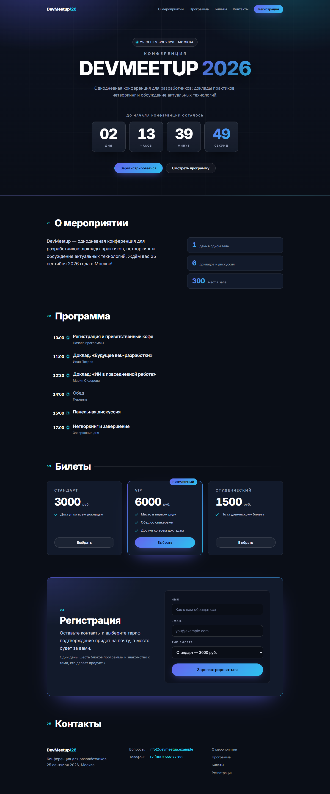

# DevMeetup 2026 — лендинг конференции

Одностраничный сайт-лендинг однодневной конференции для разработчиков
**DevMeetup 2026**. Мероприятие пройдёт **25 сентября 2026 года в Москве**:
доклады практиков, панельная дискуссия и нетворкинг.

> 🌐 **Живая версия:** <https://helkli.github.io/devmeetup-2026-landing/>



## О проекте

| | |
|---|---|
| **Название** | DevMeetup 2026 |
| **Пользователь / владелец** | [@helkli](https://github.com/helkli) |
| **Тип** | Лендинг (одностраничный сайт) |
| **Основная функция** | Регистрация участников конференции и информирование о программе, билетах и контактах |
| **Форма результата** | Статичный адаптивный веб-сайт, работающий без сервера и сборки |

## Основная функция

Сайт решает две задачи:

1. **Привлекает и информирует посетителя** — рассказывает о конференции,
   показывает программу дня, тарифы билетов и контакты.
2. **Собирает заявки на участие** — форма регистрации (имя, email, тип билета)
   с обратной связью после отправки, а также живой обратный отсчёт
   до начала мероприятия.

Дополнительно: клик по кнопке «Выбрать» на карточке билета автоматически
подставляет тариф в форму регистрации и подсвечивает выбранную карточку.

## Форма результата

- **Одностраничник** — все секции на одной странице с плавной прокруткой по якорям.
- **Тёмная тема** — конференционный стиль: глубокий тёмный фон, акценты
  индиго → циан, крупная типографика (шрифт Inter).
- **Адаптивность** — корректно отображается на десктопе, планшете и мобильном
  (меню сворачивается, таймлайн превращается в карточки, колонки складываются).
- **Живой счётчик** — блоки «дни / часы / минуты / секунды» до старта
  мероприятия, обновление каждую секунду, скрытие после начала.
- **Доступность** — семантическая разметка, `aria-live` для результата формы,
  поддержка `prefers-reduced-motion`.

## Секции

1. **Шапка** — название, навигация, кнопка регистрации, обратный отсчёт.
2. **О мероприятии** — описание и ключевые цифры (1 день, 6 докладов, 300 мест).
3. **Программа** — таймлайн по времени (с 10:00 до 17:00).
4. **Билеты** — три тарифа: «Стандарт» (3000 ₽), «VIP» (6000 ₽), «Студенческий» (1500 ₽).
5. **Регистрация** — форма с выбором тарифа.
6. **Контакты** — почта, телефон и навигация по странице.

## Технологии

- **HTML5** — семантическая разметка секций и форм.
- **CSS3** — кастомные свойства (design tokens в `:root`), `grid`/`flexbox`,
  градиенты, `clamp()` для адаптивной типографики, медиазапросы,
  `prefers-reduced-motion`, декоративные эффекты (`backdrop-filter`, маски).
- **JavaScript (ES6+)**, без зависимостей — обратный отсчёт до даты события,
  отправка формы регистрации, подсветка выбранного тарифа.

Проект не использует сборщики, фреймворки и серверную часть: файлы можно
открыть прямо в браузере.

## Структура проекта

```
index.html      — разметка всех секций
style.css       — стили (тёмная тема, адаптив)
script.js       — логика: счётчик, форма, выбор тарифа
screenshot.png  — скриншот лендинга
ЗАПУСК.md       — инструкция по запуску и задание проекта
REFERENCE.md    — референс желаемого результата
```

## Как запустить

Откройте `index.html` двойным щелчком или через «Файл → Открыть» в браузере —
сервер и сборка не нужны. Скрипт подключается в конце страницы и работает
локально.

## Лицензия

Проект опубликован как учебный/демонстрационный; права на упомянутые данные
(даты, спикеры, контакты) принадлежат их владельцам.